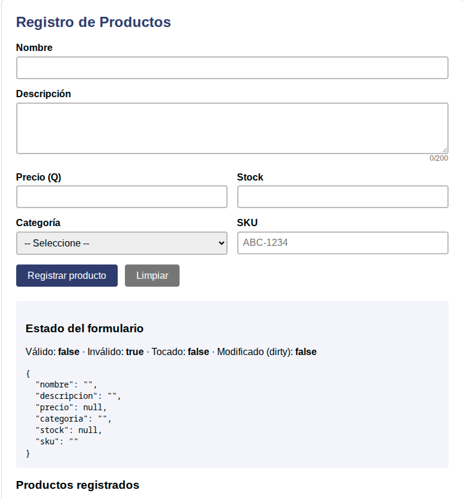
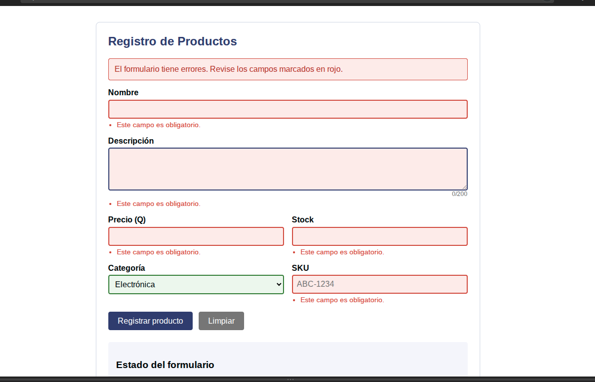
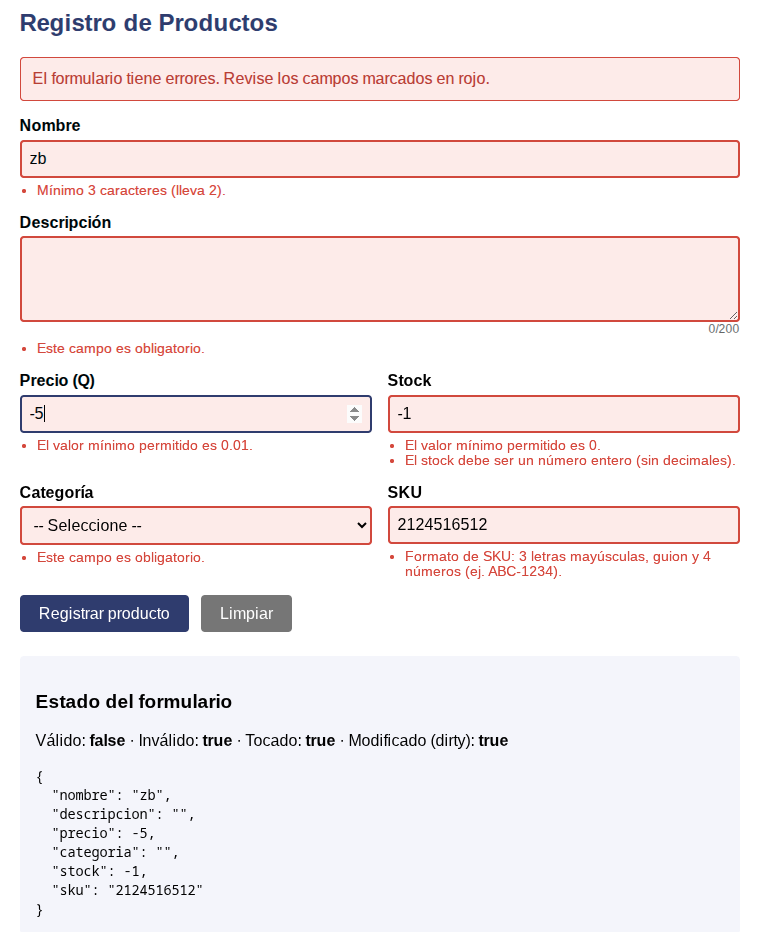
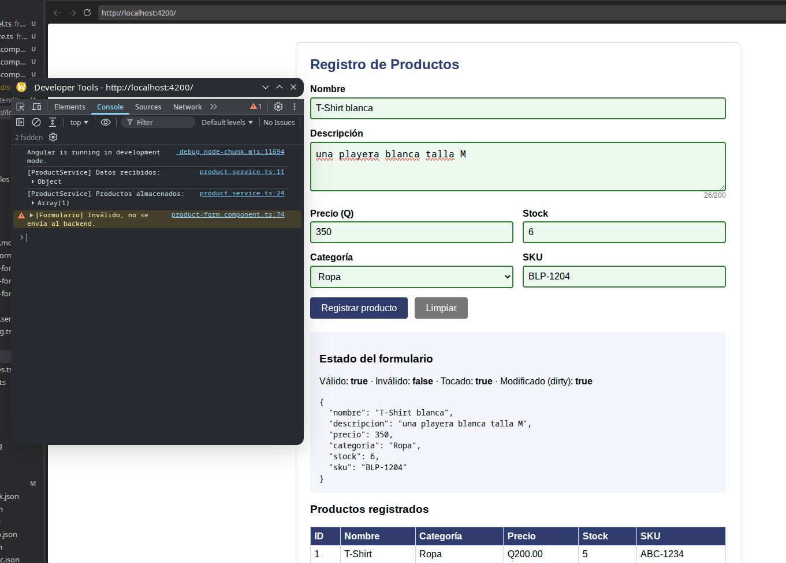
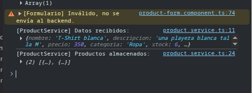

# Actividad 2 – Formulario Reactivo de Registro de Productos (Angular)

**Estudiante:** Jose Lionzo Xic Chay · **Institución:** Fundación Kinal

## Cómo ejecutarlo

```bash
ng new frontend --style=css --ssr=false --package-manager=pnpm
cd frontend
# copiar los archivos de src/app (models, services, product-form, app.ts, app.html)
pnpm install
pnpm start
```

Abrir `http://localhost:4200` y la consola del navegador (F12) para ver los logs del servicio.

## Estructura

```
src/app/
├── models/product.model.ts                 # Modelo de datos
├── services/product.service.ts             # Servicio (backend simulado)
├── product-form/
│   ├── product-form.component.ts           # Formulario reactivo + lógica
│   ├── product-form.component.html         # Plantilla (*ngIf / *ngFor)
│   └── product-form.component.css          # Retroalimentación visual
├── app.ts                                  # Componente raíz
└── app.html                                # <app-product-form />
```

## 1. Formulario y modelo de datos

El modelo `Product` define: `nombre` (string), `descripcion` (string), `precio` (number), `categoria` (string), `stock` (number) y `sku` (string).

El formulario se construye con `FormBuilder` (`fb.nonNullable.group`) y tiene un `FormControl` por cada campo del modelo. Cada control se enlaza a la plantilla con `formControlName` (data binding). El estado del formulario se muestra en vivo en la sección "Estado del formulario" con `form.valid`, `form.invalid`, `form.touched`, `form.dirty` y `form.value | json`.

## 2. Validaciones

| Campo | Validaciones |
|---|---|
| nombre | required, minLength(3), maxLength(50) |
| descripcion | required, minLength(10), maxLength(200) |
| precio | required, min(0.01), max(100000) |
| categoria | required |
| stock | required, min(0), max(10000), pattern de número entero |
| sku | required, pattern `^[A-Z]{3}-\d{4}$` (ej. ABC-1234) |

**Estados de control:** un error solo se muestra cuando el control es inválido **y** (`touched` o `dirty`), para no mostrar errores antes de que el usuario interactúe. Al enviar un formulario inválido se llama `markAllAsTouched()` para revelar todos los errores a la vez.

## 3. Uso de `*ngIf` y `*ngFor`

- `*ngIf` muestra u oculta: la lista de errores de cada campo, la alerta general de errores, la alerta de éxito y la tabla de productos registrados.
- `*ngFor` se usa para: listar los mensajes de error de cada campo (`errores('campo')`), poblar el `<select>` de categorías y pintar las filas de la tabla de productos.

**Retroalimentación visual:** campos inválidos con borde y fondo rojo (`.invalido`), campos correctos en verde (`.valido`), mensajes específicos debajo de cada control, alerta general arriba y contador de caracteres en la descripción.

## 4. Servicio e inyección de dependencias

`ProductService` está marcado con `@Injectable({ providedIn: 'root' })` y se inyecta en el componente con `inject(ProductService)`. Su método `registrarProducto(producto)` imprime en consola los datos recibidos, los guarda en un arreglo y devuelve un `Observable` con retraso de 800 ms que simula la respuesta del backend.

El componente usa signals (`enviando`, `mensajeExito`, `productosRegistrados`) para actualizar la vista cuando responde el servicio.

## 5. Flujo de envío y validación

1. El usuario llena el formulario y presiona **Registrar producto**.
2. `enviar()` revisa `form.invalid`.
   - **Inválido:** se ejecuta `markAllAsTouched()`, se muestran los errores y **no** se llama al servicio (warning en consola).
   - **Válido:** se obtiene `form.getRawValue()` y se llama a `productService.registrarProducto()`.
3. El servicio registra los datos (visible en consola) y responde.
4. El componente muestra el mensaje de éxito, actualiza la tabla y limpia el formulario.

## 6. Pruebas realizadas

### Prueba 1: Estado inicial
El formulario carga vacío y sin errores. El estado muestra `Válido: false`, `Tocado: false` y `Modificado: false`.



### Prueba 2: Envío con el formulario vacío
Al presionar "Registrar producto" sin llenar nada, todos los campos obligatorios se marcan en rojo con el mensaje "Este campo es obligatorio" y aparece la alerta general. No se llama al servicio.



### Prueba 3: Datos inválidos
Se ingresó nombre "zb", precio -5, stock -1 y SKU "2124516512". Cada campo muestra su mensaje específico (mínimo de caracteres, valor mínimo, formato de SKU) y el estado cambia a `Tocado: true` y `Modificado: true`.



### Prueba 4: Datos válidos
Se ingresó T-Shirt blanca, "una playera blanca talla M", precio 350, categoría Ropa, stock 6 y SKU BLP-1204. Los campos se marcan en verde, el estado es `Válido: true` y el producto aparece en la tabla de productos registrados.



### Prueba 5: Verificación en consola
La consola muestra el flujo completo: el warning `[Formulario] Inválido, no se envía al backend` cuando el formulario era inválido (no llegó nada al servicio) y, con datos válidos, `[ProductService] Datos recibidos` con el objeto enviado y `Productos almacenados` con los productos guardados.



### Resumen de pruebas

| # | Datos | Resultado esperado | Resultado |
|---|---|---|---|
| 1 | Formulario recién cargado | Sin errores, estado inválido y sin tocar | ✅ |
| 2 | Formulario vacío + enviar | Todos los campos en rojo, no se envía | ✅ |
| 3 | nombre "zb", precio -5, stock -1, SKU "2124516512" | Mensajes específicos por campo, no se envía | ✅ |
| 4 | Datos válidos completos | Campos en verde, formulario válido, producto en la tabla | ✅ |
| 5 | Revisión de consola | Servicio recibe datos solo si el formulario es válido | ✅ |

## 7. Cumplimiento de la rúbrica

| Criterio | Puntos | Dónde se cumple |
|---|---|---|
| Diseño del formulario y modelo | 6 | `product.model.ts`, `form` en el componente |
| Validaciones y estados de control | 5 | Validators + `touched/dirty/invalid` |
| Mensajes dinámicos y feedback visual | 4 | `*ngIf`, `*ngFor`, clases `.invalido/.valido` |
| Servicio e inyección de dependencias | 3 | `ProductService` + `inject()`, envío solo si es válido |
| Pruebas y documentación | 2 | Secciones 5 y 6 de este README |
